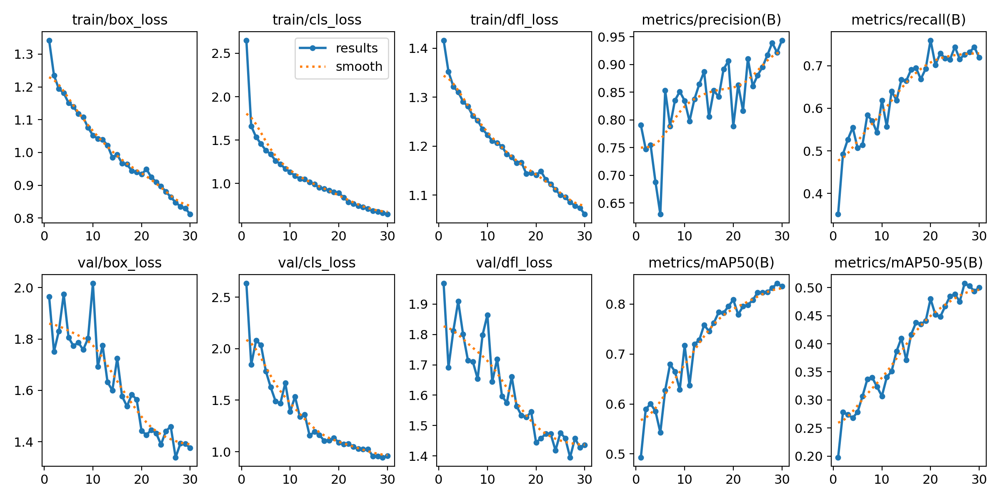

# Safety Helmet and Safety Jacket Detection with YOLOv8

## Project Overview

This repository contains the code and resources for a Safety Helmet and Safety Jacket detection system using YOLOv8. The system is designed for use on construction sites to enhance safety by ensuring that workers are wearing appropriate safety gear.

## Training Results
The model was trained for 30 epochs 

mAP = 83.5%



## Getting Started

To get started with the Safety Helmet and Safety Jacket detection system, follow these steps:

1. **Clone the Repository:** 
   ```
   git clone https://github.com/yourusername/ppeDetection.git
   ```

2. **Install Dependencies:**
   Make sure you have the necessary dependencies installed. You can usually install these using `pip`.
   ```
   pip install -r requirements.txt
   ```

3. **Run the Web Application:**
   Navigate to the project directory and run the `app.py` file.
   ```
   python app.py
   ```

4. **Access the Web Application:**
   Once the application is running, you can access it in your web browser by going to `http://localhost:8080`. You can upload images to test the safety gear detection.

## Model Deployment on AWS

The model for Safety Helmet and Safety Jacket detection has been deployed on Amazon Web Services (AWS) for scalability and accessibility. You can access the deployed model on AWS using the provided endpoint.

## Directory Structure

Here is a brief overview of the project's directory structure:

- `.github`: Contains GitHub Actions workflows for CI/CD.
- `artifacts`: Stores data related to data ingestion, data validation, and model training.
- `data`: Placeholder for the project's data.
- `log`: Logs generated by the system.
- `ppeDetection`: Python source code for the Safety Helmet and Safety Jacket detection system.
- `research`: Directory for research-related files.
- `SafetyHelmetDetection.egg-info`: Package information.
- `templates`: Templates for the web application.
- `yolov8`: YOLOv8 pretrained model and associated files.

## License

This project is licensed under the MIT License. See the [LICENSE](LICENSE) file for more details.

Thank you for using the Safety Helmet and Safety Jacket detection system! If you have any questions or need further assistance, feel free to reach out.

**Maintained by Ayan Ansar**
